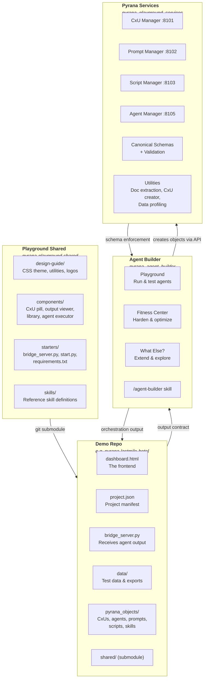
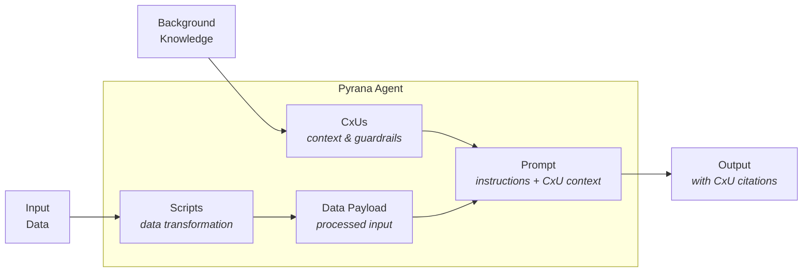
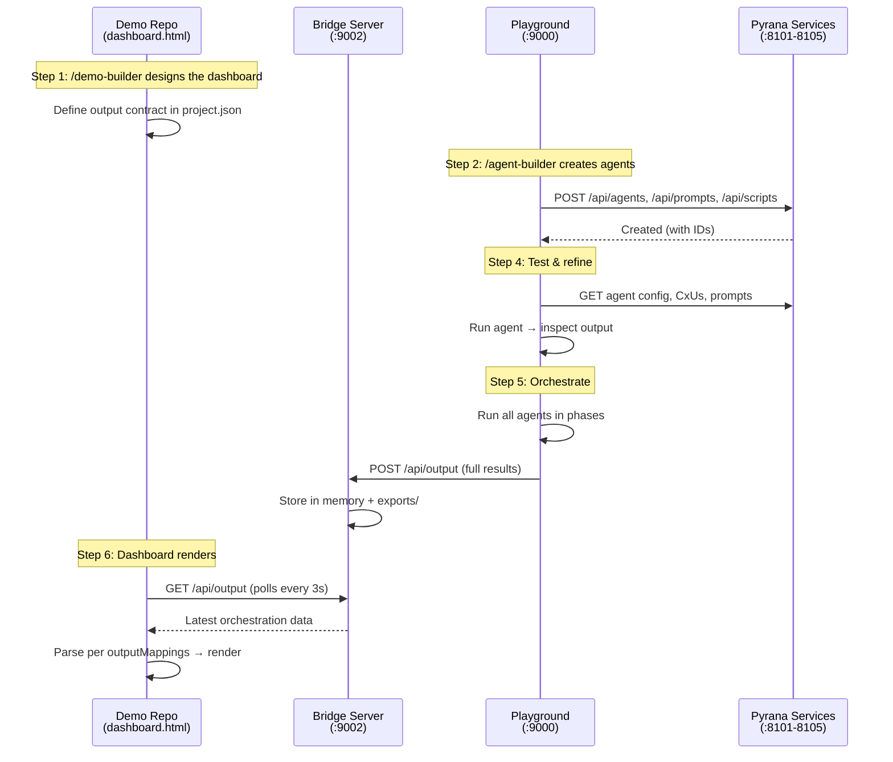

# Pyrana Playground Architecture

## What Is Pyrana Playground?

Pyrana Playground is a platform for building **agentic application demonstrations that can run on the production pyrana platform** — end-to-end applications where structured data is analyzed by orchestrated AI agents following the pyrana design flow that produce contextualized, citation-backed insights for a domain-specific dashboard.

Each demo is a full vertical slice: a beautiful frontend, backed by real agents, grounded in real context, running against real data.  Each demo is designed in a way that it can be migrated onto the production pyrana platform with minimal re-work.

---

## The Two Claude Skills

```
/demo-builder                          /agent-builder
The Creative Skill                     The Constructor Skill
─────────────────                      ────────────────────
"What should we show?"                 "How do we build it?"

- Designs the UI/UX                    - Ingests data & background knowledge
- Defines the problem space            - Creates CxUs (context units) *aligned with the pyrana_cxu schema*
- Sets MVP scope                       - Writes data processing scripts *aligned with pyrana script standards*
- Configures the dashboard             - Designs prompts with guardrails *that can run in the pyrana production platform*
- Maps output to visualizations        - Defines agent teams & phases
- Establishes the output contract      - Fulfills the demo's input requirements
```

**Demo Builder runs first.** It establishes what the user will see and what structured data the dashboard needs. **Agent Builder runs second.** It creates the agents that produce that structured data.  The **Pyrana Services** enforce compliance with production schemas and can be used to export a "demo package" consisting of prompts, scripts, and CxUs that can be imported into the production Pyrana Platform.

---

## Four Environments



### 1. Playground Shared (`pyrana-playground-shared`)

**Purpose:** The shared asset repo that all demo repos depend on via git submodule.

- **Design guide** — CSS theme, component styles, utility classes, logos. Source of truth for visual standards.
- **Components** — Reusable JS components (CxU pill, output viewer, library, agent executor)
- **Starters** — Boilerplate files (`bridge_server.py`, `start.py`, `requirements.txt`) copied into new demo repos
- **Skills** — Reference copies of `/demo-builder` and `/build-agent` skill definitions (shareable with team)

Demos pin their submodule to a specific commit. Updates are pulled selectively — open a demo, review upstream changes, update when ready.

### 2. Demo Repo (`<project>_demo`)

**Purpose:** Where the front-end is designed and the demo lives.

- The dashboard users interact with
- Test data that feeds the agents
- `pyrana_objects/` — the keeper of all Pyrana objects (agents, prompts, scripts, CxUs) relevant to this demo
- Scaffolded by the `/demo-builder` skill, which generates project-specific files
- Uses `pyrana-playground-shared` as a submodule at `shared/` for:
  - Pyrana design guide (shared CSS, dark theme, component patterns)
  - Shared components (pyrana-library, output-viewer, cxu-pill, agent-executor)
  - Starter files (bridge server, launcher, requirements)

### 3. Agent Builder (`pyrana_agent_builder`)

**Purpose:** Where agents are designed, tested, and hardened.

| Page | Role |
|------|------|
| **Playground** | Run agents, see output, tune CxUs, validate against demo requirements. Final step: orchestrate all agents and send output to demo dashboard. |
| **Fitness Center** | CxU impact analysis, model eval/fit, output challenger, efficiency testing. Produces hardened agents ready for production. |
| **What Else?** | *(Future)* Explores extensions — what else can these agents do? How can we enhance the use case? If accepted, extends agents beyond initial design. |

Holds the `/agent-builder` skill. All object creation happens via the Services API, but the Builder is where prompts are designed and tested.

### 4. Pyrana Services (`pyrana_playground_services`)

**Purpose:** The canonical source of truth for Pyrana object schemas.

- Manages the JSON schemas that define agents, prompts, scripts, and CxUs
- Accessible via REST API (ports 8101-8105)
- Provides utilities: document-to-text extraction, CxU creator, data profiling
- Enforces consistency and ensures objects work in the Pyrana platform
- Manages version control on objects
- **Does NOT store objects long-term** — objects reside in the demo repo

---

## The Pyrana Agent

Every Pyrana agent is assembled from four components:



| Component | What It Is | Example |
|-----------|-----------|---------|
| **CxUs** (Context Units) | Structured knowledge claims with provenance. Guardrails, benchmarks, definitions, rules. | "Luxury segment GOP margin benchmark: 35-50%" |
| **Scripts** | Python code that transforms raw data into the payload the LLM analyzes. | Aggregate 40 hotels x 24 months into segment-level summaries |
| **Data Payload** | The script's output — the actual data the agent reasons over. | JSON with occupancy rates, ADR, revenue by segment |
| **Prompt** | Instructions + embedded CxU context + output contract + citation requirements. | "Analyze this hotel data. Compare against benchmarks (CxUs). Produce EnhancedInsight[] with citations." |

**Key principle:** Every conclusion in the output MUST cite the CxU(s) it derives from. This creates a traceable chain from source knowledge to final insight.

---

## Story Arc — Building a Pyrana Demo

### Step 1: Design the Demo

> *"Get creative. Define the problem. Focus on UI/UX."*

Use `/demo-builder` in the demo repo to:
- Define the domain and problem space
- Set the MVP scope (what tabs, what visualizations, what data)
- Design the dashboard layout and interaction model
- Establish the **output contract** — what structured data the dashboard needs from agents
- Configure `project.json` with output mappings

**Output:** A working dashboard with placeholder/sample data and a clear contract for what agents must produce.

### Step 2: Build the Agents

> *"Create the agents that fulfill the demo's requirements."*

Use `/agent-builder` in the builder to:
- Ingest background knowledge → create CxUs
- Connect to data sources → write processing scripts
- Design prompts with CxU context and guardrails
- Build agent teams with execution phases
- Tag everything with the project tag

**Output:** A set of agents, each with CxUs + script + prompt, registered via the Services API.

### Step 3: Enforce Standards

> *"Make sure everything follows Pyrana schemas."*

The Services API validates:
- CxU schema compliance (alias, claim, knowledge_type, claim_type)
- Prompt schema compliance (objective, output_contract, cxu_context)
- Script structure and tagging
- Agent configuration and phase assignments

**Output:** All objects pass schema validation and are properly versioned.

### Step 4: Refine in the Playground

> *"Test, tune, iterate."*

In the Playground:
- Run individual agents and inspect output
- Tune CxUs that cause poor quality results
- Verify output meets the demo's output contract
- Adjust prompts and scripts as needed
- Run the Fitness Center for deeper quality analysis

**Output:** Agents producing consistent, high-quality, citation-rich output.

### Step 5: Orchestrate and Populate

> *"Run the full workflow and send results to the demo."*

In the Playground:
- Run orchestration (all agents in phase order)
- Click **"Send to Dashboard"** → POSTs to demo's bridge server
- Dashboard polls and renders: KPIs, charts, insights, actions, benchmarks

**Output:** A live demo populated with real agent output.

### Step 6: Show It

> *"Synthesize some data and show the application in action."*

The demo is now a self-contained, runnable application:
- Real dashboard with real visualizations
- Real agent output with traceable CxU citations
- Click any CxU pill to see the source knowledge
- Browse all Pyrana objects in the Library side tray

---

## Data Flow — End to End



---

## Port Map

| Port | Service | Environment |
|------|---------|-------------|
| 8101 | CxU Manager | Services |
| 8102 | Prompt Manager | Services |
| 8103 | Script Manager | Services |
| 8104 | Skill Manager | Services |
| 8105 | Agent Manager | Services |
| 9000 | HTTP Server (Playground, Builder, Fitness Center) | Agent Builder |
| 9001 | Script Executor | Agent Builder |
| 9002 | Bridge Server (Dashboard + API) | Demo Repo |

---

## Quick Reference — What Lives Where

| Artifact | Resides In | Created Via |
|----------|-----------|-------------|
| Design guide (CSS, logos) | `pyrana-playground-shared` | Manual (source of truth) |
| Shared components (JS) | `pyrana-playground-shared` | Manual |
| Starter files (bridge, launcher) | `pyrana-playground-shared/starters/` | Manual |
| Skill definitions (reference) | `pyrana-playground-shared/skills/` | Manual |
| Dashboard HTML | Demo repo | /demo-builder (generated) |
| project.json | Demo repo | /demo-builder (generated) |
| bridge_server.py | Demo repo | Copied from `shared/starters/` |
| Test data | Demo repo | /agent-builder (copied) |
| Pyrana objects (CxUs, agents, etc.) | Demo repo `pyrana_objects/` | /agent-builder (exported) |
| Canonical schemas | Services | Manual |
| Playground/Fitness pages | Agent Builder | Manual |

---

## Updating Shared Assets

`pyrana-playground-shared` is the source of truth for design guide CSS, shared components, and starter files. Changes made there can be pulled into any demo on demand.

### Pushing an update (maintainer)

```bash
cd ~/Code/github/pyrana-playground-shared
# Make changes to design-guide/, components/, starters/, or skills/
git add -A && git commit -m "Update library tray animation"
git push origin main
```

### Pulling an update (in a demo repo)

```bash
cd ~/Code/github/pyrana-lastmile-hotel  # any demo repo
cd shared
git fetch origin
git log HEAD..origin/main --oneline     # review what changed
git diff HEAD..origin/main -- design-guide/  # inspect specific changes
git pull origin main                     # import updates
cd ..

# If starter files were updated and you want them:
diff shared/starters/bridge_server.py bridge_server.py  # check before overwriting
cp shared/starters/bridge_server.py .

git add shared
git commit -m "Update shared assets to latest"
```

Each demo pins its submodule to a specific commit. No demo auto-updates — you review and decide.

---

## Demo Repo Structure

A fully scaffolded demo repo looks like this:

```
pyrana-<project>/
├── shared/                    ← git submodule (pyrana-playground-shared)
│   ├── design-guide/          ← CSS, logos (served at /design-guide/)
│   ├── components/            ← JS components (served at /components/)
│   ├── starters/              ← Boilerplate source files
│   └── skills/                ← Reference skill definitions
├── bridge_server.py           ← Copied from shared/starters/
├── start.py                   ← Copied from shared/starters/
├── dashboard.html             ← Generated by /demo-builder
├── project.json               ← Generated by /demo-builder
├── pyrana_objects/             ← Platform artifacts
│   ├── cxus/
│   ├── agents/
│   ├── prompts/
│   ├── scripts/
│   └── skills/
├── data/
│   ├── sample-output.json
│   ├── test-data/
│   └── exports/
├── requirements/
│   ├── problem-statement.md
│   ├── output-contract.md
│   └── architecture.md
├── requirements.txt
├── CLAUDE.md
└── .gitignore
```
